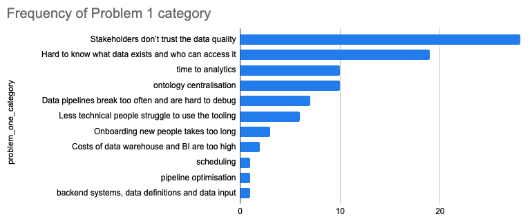
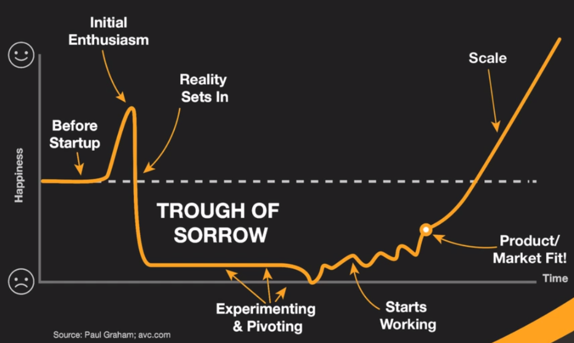

These are some of the tough lessons lessons learned from my start-up journey. Writing this has been incredibly cathartic.

My top two key-takeaways are:

1. Validate the problem and willingness to pay upfront i.e. find someone that says 'how can I use this now? Please take my money'

2. Stress test your co-founder relationship.

# Product
For a little context, our two sentence description of ilumadata was:
> *ilumadata is Retool for data pipelines. We're building a cloud editor for enterprise data teams that makes it easy to build, test, and launch data transformations in seconds.*

Lessons:
- Read [the Mom test](https://www.goodreads.com/book/show/52283963-the-mom-test?ac=1&from_search=true&qid=hsNb4HuTjb&rank=1) first, it's a quick read and will save you a lot of time. To validate your product, you need to:
	- Find and validate the problems your target market has. Ask, *what is your biggest problem? Have you tried fixing it? How often does this happen? What is the impact?*
	- Get some sort of commitment. *Will they sign a Letter of Interest (LOI)? Introduce you to their boss? Pay money now?* Yes you can do this without a product.
- For ilumadata the adoption cost was greater than the value add. See the [Collison install](http://www.startupengine.org/2013/08/the-collision-installation.html) for how Stripe reduced their initial adoption cost.
- The difference between iterating on your product based on discovery calls and no users vs. *paying* users is huge.
- Ultimately ilumadata was a *nice to have* - a proliferation of data tools, and a change in the macroeconomy meant no space for nice to haves.
 - Having domain expertise can de-risk the venture. A lot of seed funding is based on a solid team with a domain insight. On reflection, was our insight shallow? Maybe, there are a million reasons for why startups fail. The big product de-risk is asking, do people want this? No, do they *really* want it? I *thought* I de-risked this early on with some discovery calls, but in retrospect they failed the [Mom test](https://www.goodreads.com/book/show/52283963-the-mom-test?ac=1&from_search=true&qid=hsNb4HuTjb&rank=1). To de-risk efficiently, try selling a product that doesn't exist.
- Iterate faster - constantly update what you are trying to learn from the next call. What is the hypothesis you are trying to prove/disprove?
- There isn't a definitive way to know when to pivot. There are plenty of examples where founders stuck to their initial idea and it worked out e.g. Retool and Airbnb. In our case we did not have enough traction to justify sticking to our initial idea.

>"if a company makes a product that people dislike yet still buy, then presumably they'd buy a better alternative if you made one" - [pg](http://paulgraham.com/superlinear.html)

- 👆 When we started, no one liked dbt cloud, the mistake was thinking they were an indicator of success. Yet a year later, based on our user interviews dbt cloud did not appear to have high uptake of their paid cloud product. 7 months into our venture they had laid off 50% of their workforce and doubled their pricing. dbt core solves some real pain points, but as far as I can tell, dbt cloud is a nice to have. dbt has recently overhauled their cloud product, so perhaps they have found a way to make it a must have - time will tell 🤷‍♀️
- Does your product need SOC II? We thought we did. We had found an evangelist user at a large US heathcare company who was keen to use ilumadata. Maybe it's going to be our first enterprise sale! In prepping us for the sales process they said we needed SOC II. So we rushed out and got it in two weeks. The lead went cold, completely ghosting us 👻. But we'd just forked out 20k to get our shiny SOC II badge. In hindsight, before getting SOC II, we should have been in front of the *buyer* and got a commitment from them. SOC II companies sell early stage startups on fear 'Don't let SOC II be the reason you lose your first big deal'.  If you are really solving a problem, you should get a commitment from the *buyer* before you get SOC II.
- We were building a data platform, a data operating system, a *single pane of glass* for data infrastructure. Rather than tackle one single easy to communicate problem, we were solving many smaller problems. We'd tell ourselves certain features were table stakes. For early stage, I'd avoid being a platform. It's hard to communicate, hard to sell and hard to build.
- Start quantifying the top problems from each discovery call. [Card sorting](https://maze.co/guides/card-sorting/) is a great exercise to do this. Put 5-7 problems you think your persona has on a kanban board, share your screen and ask them to sort them from most painful to least. Several months in, we realised that we weren't addressing the most significant or painful problem. Card sorting also gets people talking about their problems.
- In an attempt to breach the chasm between the data team and the rest of the business, we fell into it. The product was too technical still for business folk and too light touch for those tech inclined data people.

# Co-Founders
> Here's a guide on: [How to find a co-founder](../how-to-find-a-co-founder/)

Co-founding a company is the business version of marriage. The first signs we didn't work well together occurred during the YC batch. We had left the happy place of coding as a side project, and now were making all sorts of time pressured decisions to make this a successful company. Our communication styles were very different. Founders are literally the foundation of the company, not working well together always meant a separation was inevitable[^1].

Lessons:
- Perhaps the most important factor in an early stage startup, *really* invest time here building and testing the relationship.
- Make sure you go through and write down your answers to [First Mark's 50 Founder Questions](https://proof-assets.s3.amazonaws.com/firstround/50%20Questions%20for%20Co-Founders.pdf). It prompts both you and your potential co-founder to reflect on some hard questions, but also helps uncover where there are discrepancies between the two of you. Do this before you start working together. We didn't do this.
- It is a marriage, your incorporation documents are your marriage certificate and it takes significant legal fees, stress and heartache to get divorced. Would you get married to someone you haven't really spent time getting to know?
	- Work together - starting to code on the idea is unlikely a good stress test. It's just one area of what you need to work on as founders and as tech co-founders you're in your happy place! It tests whether you work as an engineering duo. But what about when you're stressed, tired, and have to make a decision on product direction? I know founders who have purposely set up 12hr days working side by side with a packed agenda to stress test. Others have gone on a two week working 'holiday' together - and then chosen not to continue, a lot better than years later.
	- Pick things you disagree on and commit to debating passionately. If you can't do this productively now, how will you in the future?
- Listen to any negative hunches you might have - this will likely get worse later on. Would you hang out solo with them, just for fun? If not, why not?
- Pre-define areas of ownership. I made the mistake of everyone does everything, which is often true in startups, but everyone doesn't have to *agree* on everything. Seeking consensus on operational items should perhaps be open to a round or two of feedback, but ultimately the decision to execute and move fast lies with the owner. Your co-founder should be comfortable with this. Areas of responsibility and how you resolve deadlocks is covered in the [50 Founder Questions.](https://proof-assets.s3.amazonaws.com/firstround/50%20Questions%20for%20Co-Founders.pdf)

# Sales
We initially had an enterprise sales motion. Following several months of zero traction, we shifted our focus down market, targeting small to medium enterprises. Take the following lessons with a grain of salt, because ultimately we didn't make lots of sales! 😞

Lessons:
- Enterprise sales is hard. Super long sales cycle. Lots of touch points. I've had a few emails an entire year later saying they are now 'interested' in buying.
- Pre-Product Market Fit both founders should be doing at least some selling. Stick your noses into the market. If you're not selling, you're not learning. And if you haven't found a 'hair on fire' problem, then building may be a waste of time. But sure does feel productive!
- Customer onboarding - ensure technical founder/s are present for this. Feel the customer onboarding pain, so it gets prioritised appropriately against other engineering pains.
- Read the Mom test first, oh I said this already! Have you read it yet?
- You can sell first, then build. Yes, sell a product that doesn't exist. Do outbound "we're building X that solves Y" - this is your hypothesis that you should be able to accept or reject after 5 decent calls. Focus on the person's problems and if what you're building solves a genuine pain point, be transparent about the development progress and get a commitment e.g. a meeting with their boss or an LOI or a design partnership!
- There were a couple of hunches I felt when selling to a technical audience. Firstly, they were more interested in *how* you engineered something - were they wondering how to build it themselves? Secondly, technical teams trust open source more. Which is related to the ease of adoption.
- Depending on your product, the user and buyer may be different people. This makes it harder for you to sell. As you need to win both to be successful.

**Buyer**
- We took too long to realise the initial problem we were solving was not the top priority. There was much greater concern with data quality. Here's the results from the card sorting exercise of 88 calls. The problem we started solving placed 6th 🤦‍♀️.

- Start with buyer validation, not user validation. Getting a commitment from a buyer is better than the commitment a user can offer you.

**User**
- We spoke to many users and got introductions to their bosses. But initiating contact with users to reach the buyer, involves engaging multiple people within the same company to identify someone willing to intro you. Start with the buyer, at least you can qualify them faster, *Please Sir, do you have budget?*

# Investors
I'm extremely grateful to everyone who took a bet on ilumadata. We raised a small round ($720k) from a mix of angels and a VC.

- Don't be afraid of owning your failure i.e. don't let ego get in the way. I let this get in the way of regular investor updates, I'd think *I'll wait for some good news* (that never came!). I should have been more open with investors, they are there to help you. I was afraid of being judged, but in retrospect I was judging myself more harshly than they would have.
	- Many investors will go into bat for you. If you're not open with them, they can't help you.
- We raised a small round but it cost 2 months of time. Did we need to raise? Whilst in YC "The mantra was if you _can_ raise at Demo Day, you _should_ raise" (see [another YC founder's experience of this](https://www.lennysnewsletter.com/p/startup-to-exit-lessons-from-a-first))
	- We could have proven this idea didn't work with only the YC investment. In fact, we could have validated it with no money!
- Don't be driven by investors, they are not the buyer.
	- If they ask for a product roadmap and you are pre-PMF and pre-seed, this is a waste of time. Spend time on getting traction. I remember Siebel during our batch saying "chuck out your Product Roadmap!"
	- I've filtered out potential co-founders based on focusing on 'investor traction' rather than customer traction.

# Market
- You don't want to be working on a 'nice to have' at the best of times. But if you are and you have a enterprise sales motion, recession fears and major tech lay offs mean most enterprise doors are closed.
- One early thought was - 'if we improve productivity even by a tiny fraction like 5% then using ilumadata is an obvious win'. Firstly, your adoption cost needs to be low to prove this, ours was not. Secondly, even this is not enough, you need to solve a problem and 'improving efficiency by 5%' is not a problem, let alone a painful one.
- Market Saturation - so many tools in this space, and it only got worse as we were out there. We thought our product was unique or at least sufficiently different, then we started finding many companies doing the same thing.
- Outside of the real core of a data platform, cloud data-warehouses and BI, who is getting decent revenue? I had a couple of investors that had invested elsewhere in the modern data stack that many of the big names in that space weren't making much in the way of revenue.

#### See also
- [Cascade - Similar startup that failed](https://www.cascade.io/epilogue/the-data-and-analytics-market)
- [Category Collapse](https://benn.substack.com/p/category-collapse)
- [Guide to startups](https://pmarchive.com/guide_to_startups_part4.html)

# Legal
- Cease and desist - we got one. It scared us and distracted us for at last a month. Don't be scared of this. Unless - you really did break laws!
	- Our YC Partner congratulated us, saying it's a sign you're doing something right. It's a badge of honour.
	- Big incumbents sometimes monopolize the leading law firms by simultaneously assigning legal matters to all of the top-tier firms. That way, the law firm you're using will have a potential conflict of interest and need the company that sent you the C&D to sign a waiver. Which of course they won't do! It's like a game of monopoly, and they've parked hotels on the top end of town.
	- Get referrals to boutique specific law firms - we landed an incredible litigation firm that was very reasonable on the company purse.

# Self
- Mental health - I'm not someone who has had any diagnosable mental health issues. Doing a startup is very hard. Everyone tells you this. But the lived experience is very different. Facing hundreds of rejections, many iterations, a hard pivot, co-founder separation and eventually a wind-down is tough. I remember seeing the 'trough of sorrow' graph before going through YC, it's very real!

- Sales Led Growth is hard! Not sure if it would be different with better traction - a bit of dopamine goes a long way.
- I'm definitely not a perfectionist - if it works, let's ship it! I'm very comfortable with things being rough around the edges.
- I learnt more about what *I need* from a co-founder. Much like your first non-platonic relationships, you learn the hard way what works and doesn't work for you.
- I found talking to other founders really helpful, normalising the struggles unique to startups, hearing about what they have tried, what's worked and what hasn't - it's something I do regularly now, but could have done more through the hard times. This is a huge benefit of going through an accelerator, to forge your network of entrepreneurs.
- CEO - this role is tough, and it's a role I don't particularly relish as a full-time position. A lot of startups in our batch had the fight over the role, many have co-CEO's until your group partner finally yells at you enough to change! For us, CEO was really who drew the short straw! Early on, I split my time between sales and dev work. After all, we had an MVP to build. 6 months in and the code base was still 40% written by me. This felt productive, but in retrospective validating the problem and willingness to pay would have been time better spent. The last few months of the venture I was pure sales/product, soft pivoting through problem areas in the modern data tooling space. When the business/tech ratio became 100% business for me, that's when I realised I didn't want to be CEO.
- There is an inherent duplicity that must be maintained, startups are innately difficult and full of uncertainty. But you must project confidence and optimism when raising funds, when selling to customers and to (potential) employees. All whilst you might be plagued by doubts or recovering from the last bruising 'No' you were banking was a 'Yes'! I found this balance hard to maintain.
- I sought consensus. Given the co-founder relationship was already strained, I didn't want to add fuel to the fire. What I should have done, was make clear areas of responsibilities, provide a short time frame for feedback and then execute. The trade-off is speed vs. consensus, and for early stage startups you don't have much time.

# Essential reading
- [startup primer](https://docs.google.com/document/d/1pUdqNJf0hchC96ZW142vE7xKPNsWZpw_GF_PIf9pJ7k/edit)
- https://evis.substack.com/p/we-grew-from-0-to-150k-in-6-months?r=7zecw

# Footnotes
[^1]: One exception to this is if you find PMF - it solves everything. I've heard of founders absolutely hating each other and that trickling down into very poor company culture. But when you're on a rocket ship to a big payout, people will stick it out 🥕!
